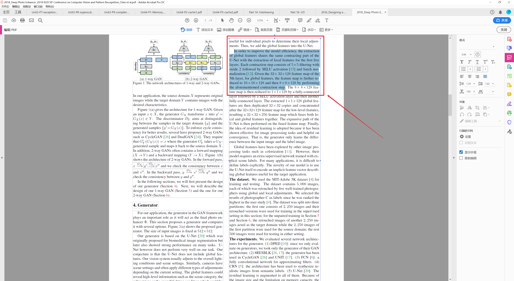

# 如何无换行符复制PDF（论文）中的多行内容

由于我所接触到的大部分论文和各种其他资料如书籍和PPT往往最后都会以PDF文件的形式被分发，而阅读和理解这些内容的同时经常需要拷贝出部分内容到笔记或展示的PPT中。但如果直接选中并拷贝文件中连续的多行内容，粘贴到Typora或MS Office中后会发现绵延不断的换行符，比如像这样：

> In order to improve the model efficiency, the extraction
> of global features shares the same contracting part of the
> U-Net with the extraction of local features for the first five
> layers. Each contraction step consists of 5×5 filtering with
> stride 2 followed by SELU activation [15] and batch normalization
> [12]. Given the 32× 32×128 feature map of the
> 5th layer, for global features, the feature map is further reduced
> to 16×16×128 and then 8×8×128 by performing
> the aforementioned contraction step.

甚至到粘贴到Google翻译中也是如此。这对笔记和翻译十分不便。然而我在Google和知乎上搜索了一番，绝大多是答案都是先拷贝到Word或其他软件中再使用替换功能将换行符删掉。问题是，这样还是十分麻烦，每次拷贝粘贴需要接近10s左右的额外处理时间，这是无法被长期使用的。难道没有一个更好的解决方法吗？

经过自己在Adobe Acrobat上的一番尝试后，我发现了堪称最佳的解决方案，只需要点一个按钮，后面的复制内容全部不会包含换行符，额外处理时间几乎为0。下面来简单介绍一下：

##  随意打开一个PDF文件

## 点击右侧“编辑”按钮

如果这里没有显示，你可以选择在视图中调出边栏或点击进入“工具”后选择编辑PDF。

我这里使用的是当前最新版的Acrobat，如果您的版本较低，请自己找到编辑PDF选项。

## 开始复制！

点击编辑PDF按钮后，不难发现Adobe Acrobat已经对文章的内容进行了大块的划分，而每个大块内部的内容复制时，是不会插入换行符的，而在绝大部分时间，你所需要的内容都会被正确的划分在一起。之后就舒服的选择需要拷贝的部分拷贝即可，就像这样：

> In order to improve the model efficiency, the extraction of global features shares the same contracting part of the U-Net with the extraction of local features for the first five layers. Each contraction step consists of 5×5 filtering with stride 2 followed by SELU activation [15] and batch nor-malization [12]. Given the 32× 32×128 feature map of the 5th layer, for global features, the feature map is further re-duced to 16×16×128 and then 8×8×128 by performing the aforementioned contraction step.

好了！本期的内容到此结束。如果您追求完美，请注意原本行末会有的连字符“-”，可以进行替换消掉，但大多数时候如果是自用的笔记，直接拷贝出来的结果已经是很好的了。