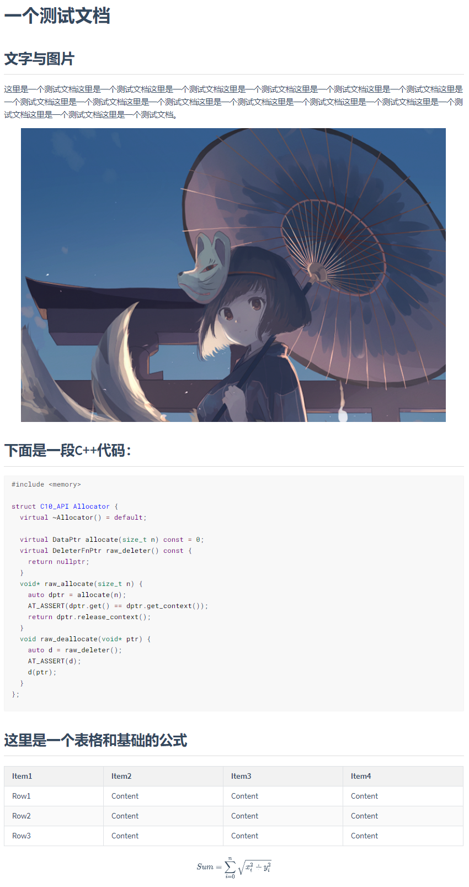
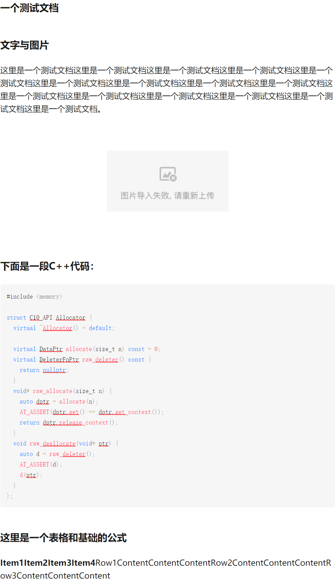
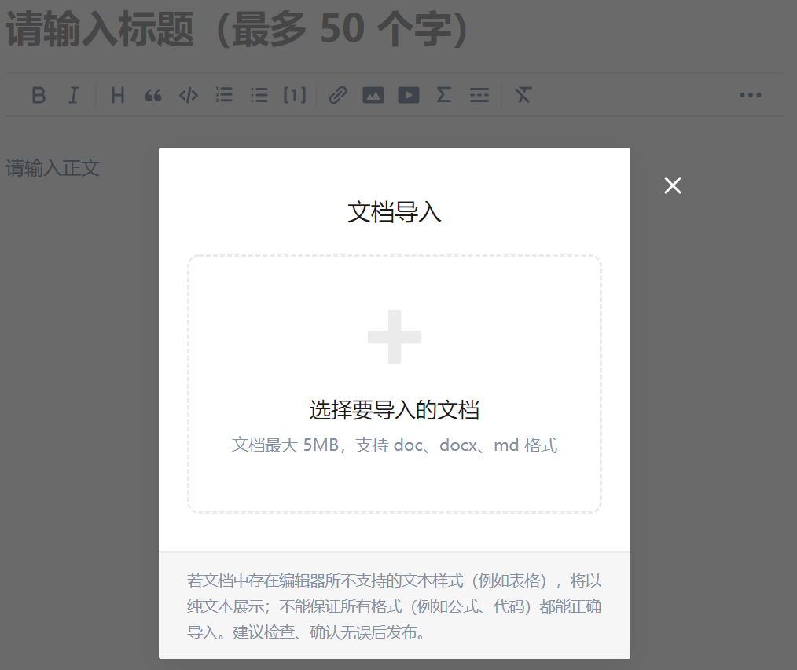
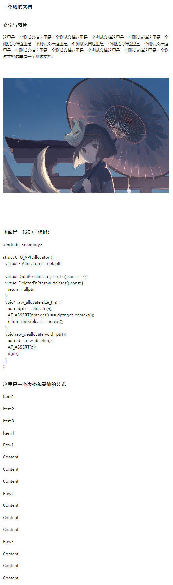
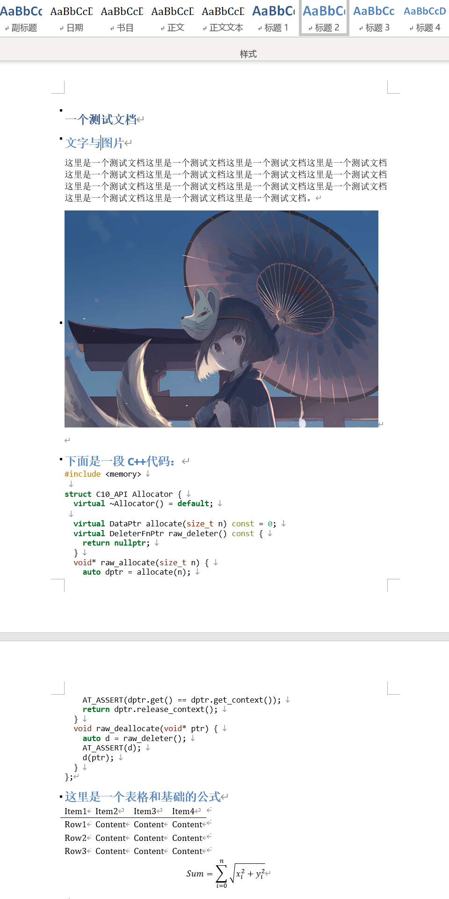
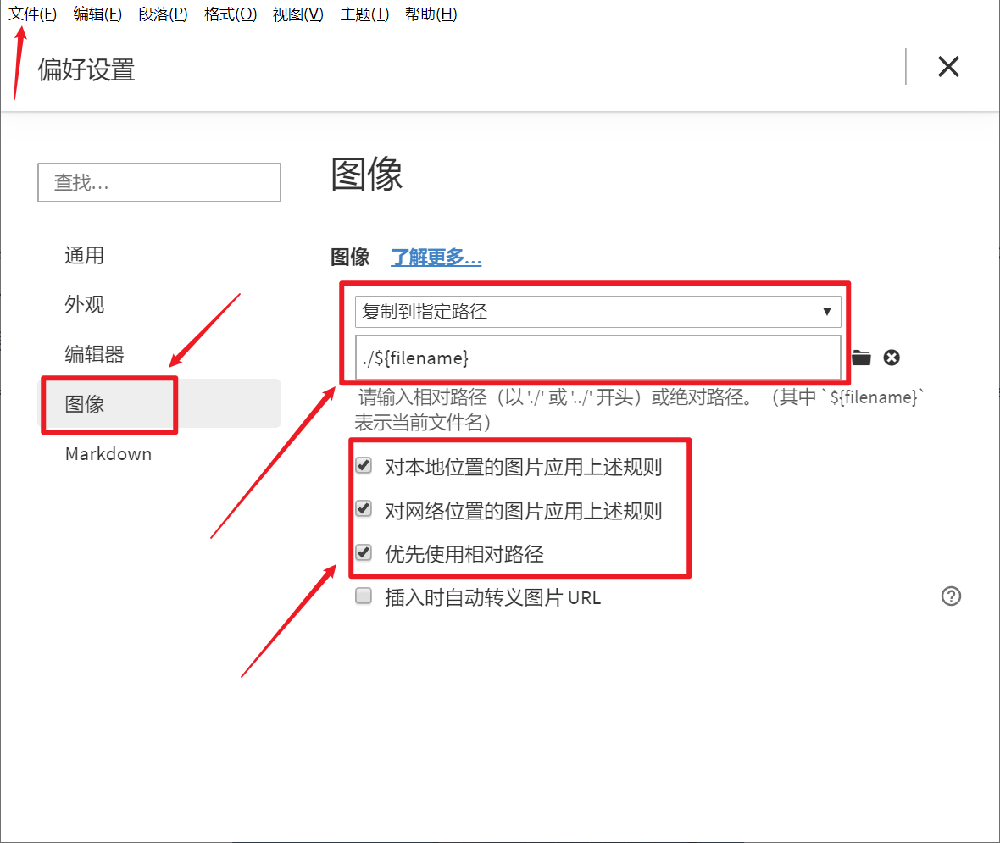
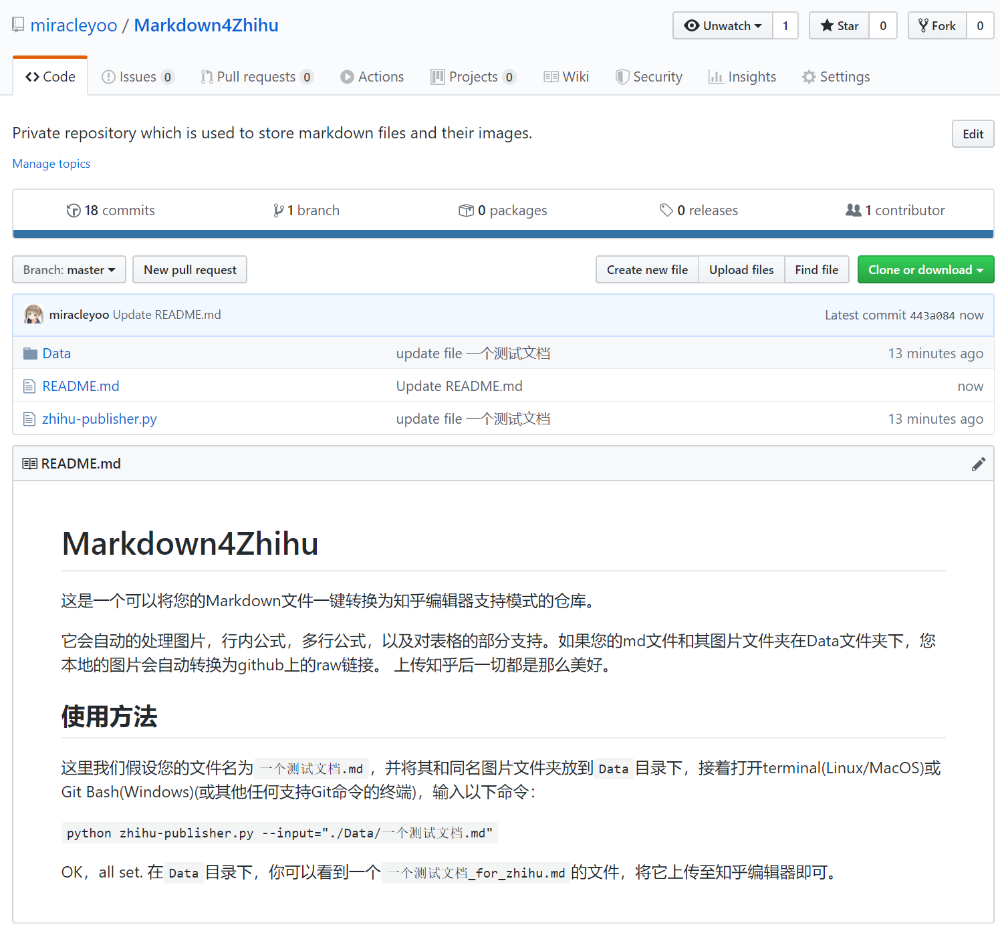
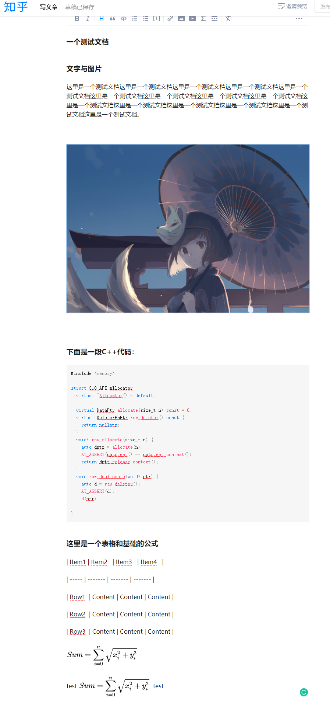

# 避免脏活，完美使用Markdown在知乎编辑内容

首先吐槽一下知乎的编辑器。虽然个人博客上的不少内容都曾有想过搬到知乎一份，但是知乎的编辑器真的是令人绝望式的难用。尽管现在可以使用文件导入功能导入md文件和Word文档，且能支持一些简单的Markdown语法，但每种途径都有着无法避免的缺点，从结果上来说则是只能被迫接受或是不完美的格式亦或是大量手动且重复的图片上传。

口说无凭，这里放一下几种方法的对比图来详述一下问题所在：

### Typora中原文件

这份测试文件虽然短，但是基本包含了常见几种要素：标题、正文、图片、表格、代码、公式。下面让我们看看知乎支持的几种上传方式的效果：

### 1. 直接复制Typora中的内容到知乎编辑器

可以看到，标题和正文区分开了，不过所有的标题都变成了一级标题。另外本地的图片无法导入，只剩下一个展占位符。表格全乱，公式直接消失了。但代码的高亮仍是C++，正确。

### 2. 直接导入Markdown文件

你可以在编辑器的这个位置导入文件：

导入刚才我们看到的测试文件原档的效果是这样的：

同前，标题和正文区分开了，不过所有的标题都变成了一级标题。另外本地的图片无法导入，只剩下一个占位符。表格全乱，公式没有消失，但也并没有被渲染。代码的高亮仍是C++，正确。

### 3. 先使用Typora导出为Word，再用知乎编辑器导入Word

上面的两种最直观的方法的一大问题就是图片导入不进去。而对于一些长篇的科技文章，图片既多又重要，手动一个个添加容易错而且浪费科研人员的时间和热情。当然我知道导入Markdown时并没有顺带把图片本身导入进去，但我仍觉得这是知乎团队应该做的工作，而且是相当基本的工作。好吧，既然现在不可行，那么导出成Word再导入该不会有这个问题了吧，我们来看看：

好家伙，图片导入进去了，表格直接炸飞天了，而且更可气的是代码的高亮没了，格式也出现了问题。其他的嘛，不看不得了，一看发现公式似乎直接没了，中间还莫名其妙多了一堆空行。当然，标题等级的问题还是没解决。

那是Typora导出Word导出的不好吗？我打开了导出的Word文件：

公式存在，高亮正确，标题等级正确，表格正确，没有奇怪的空行。虽然和Markdown渲染的结果相比也并不好看说实话，但至少它是对的，而知乎编辑器错的五花八门。

## 那么，如何拯救自己的双手和灵魂呢？

### 首先调整好你的Markdown编辑器

为什么要首先调整好编辑器呢？这里我说的调整主要指的是对图片管理方式的调整。如果您使用Typora，建议在偏好设置页面将相关参数调整至和下图完全一致，以防后面出现问题。

这里做的工作主要是将所有来源的图片都自动保存至同名文件夹下，以相对路径储存。使用其他Markdown编辑器的小伙伴也可以对照调整。这么做的目的主要是为了方便后面对图片的批量上传与转换。

相信很多同学看到这里就会发出疑问，为什么不适用iPic之类的图床软件直接上传至图床呢？既方便又舒适。我的答案是，因为我吃过亏。我的内容之前一直独发于我的个人博客，然而今年中旬，突然之间整个网站所有的图片都挂掉了，只显示一个占位符和无法访问的提示，之后我发现之前使用的新浪图床加入了防盗链，所以就GG了。当然后面我也用Python再一次解决了这个问题，对解决方法感兴趣的图形可以移步这里，然而这一次的教训让我理解了这些图床**并不可控**。它们随时可以剥夺掉你博客中的全部图片，而你是无力至极的。

在那之后，我就选择了本地储存+Github备份的模式，这样既可以永久有安心的本地档，也有方便使用的Github链接，可以说是既方便又安全。

### 之后解决图片上传问题

最方便的解决办法即为利用好GitHub的资源了。建立一个Public的GitHub仓库，这里我命名作**[Markdown4Zhihu](https://github.com/miracleyoo/Markdown4Zhihu)**，注意一定要为Public，否则知乎无法访问这些图片。

当然，如果你觉得麻烦，也可以直接folk我建好的仓库，一会儿我们要提到的“一键Markdown知乎适配脚本”也会在这个仓库里。你只需要将你的文件和相应的图片文件夹放到这个`Data`子目录下，即可调用脚本一键转换，并将涉及到的图片自动推到你相应的GitHub仓库中。

这是我们使用脚本一键转换后的结果。它很好的解决的图片上传的问题，同时也保证了代码段的高亮，同时，所有的行内公式和多行公式都得到了转换。转换后的公式在知乎上传文件之后，是可交互的，即你可以在上传之后在知乎编辑器中修改你的公式，而不必重新再来一遍。

至于表格，这个真木得办法，因为知乎压根不支持表格你说这咋整嘛。但是也不是没有可替代方案。如果表格不是很多，你可以直接对其进行截图，删去原代码后粘贴截图。之后它就会按照图片模式被兼容上去。如果你不想截图也可，做了相应操作后会得到上图的结果，对于少量表格来看也是OK的。你可以在[这里]( https://zhuanlan.zhihu.com/p/97432671 )看到上传到知乎后的效果。

### 最后是具体使用流程

这里我们假设您的文件名为`一个测试文档.md`，并将其和同名图片文件夹放到`Data`目录下（如果新建文件时就直接在Data里面建会更加方便），接着打开terminal(Linux/MacOS)或Git Bash(Windows)(或其他任何支持Git命令的终端)，`cd`进入该项目的根目录，即`Markdown4Zhihu`目录，输入以下命令：

`python zhihu-publisher.py --input="./Data/一个测试文档.md"`

OK，all set. 在`Data`目录下，你可以看到一个`一个测试文档_for_zhihu.md`的文件，将它上传至知乎编辑器即可。

PS: 脚本使用Python3，Python2可能会有潜在问题。

## 最后的话

知乎的开发者的逻辑其实我真的比较迷，我们大学学生团队的自建论坛都可以原生完美支持Markdown和公式，然而知乎却一直说这个功能必要性不足强调开发难度。同样令人难受的是知乎的搜索，多少年过去了非热门话题还是一如既往的难用，搜索还是借助Google 的 “问题+知乎”。不知道这是什么原因，不过还是希望知乎团队先把这些非常基础的东西做好再大谈用户体验。

这次的解决方案需要对GitHub和命令行有基础的了解，不过考虑到会来读这篇文章的人应该程序员居多，问题应该不是很大。脚本还比较新，如果有bug欢迎提出。最后再放一下GitHub链接，如果它有帮到你，希望能随手留下一个star，谢谢！**[Markdown4Zhihu](https://github.com/miracleyoo/Markdown4Zhihu)**

