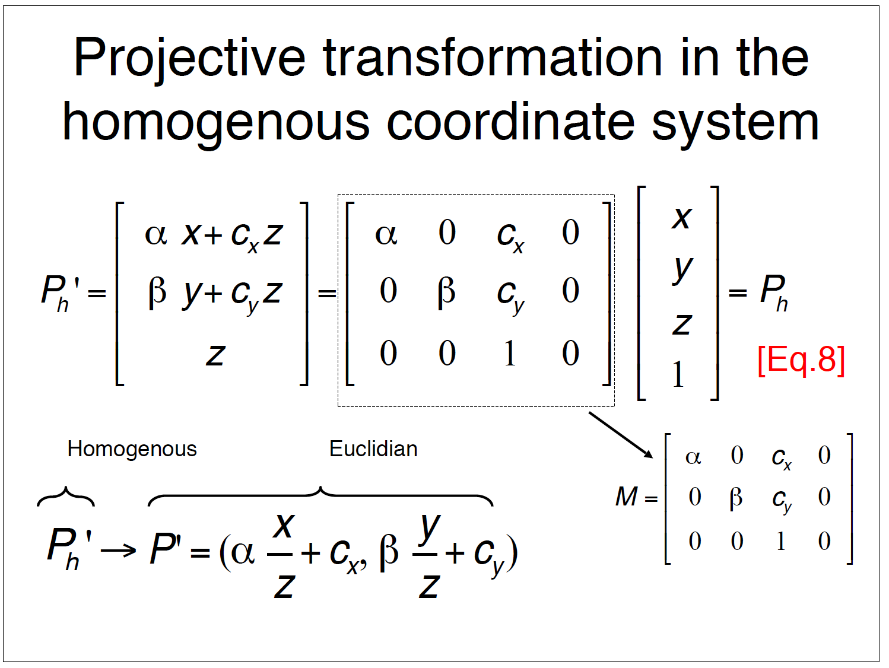
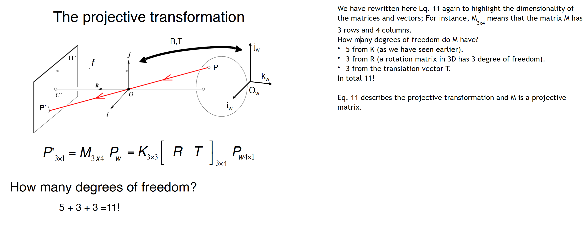
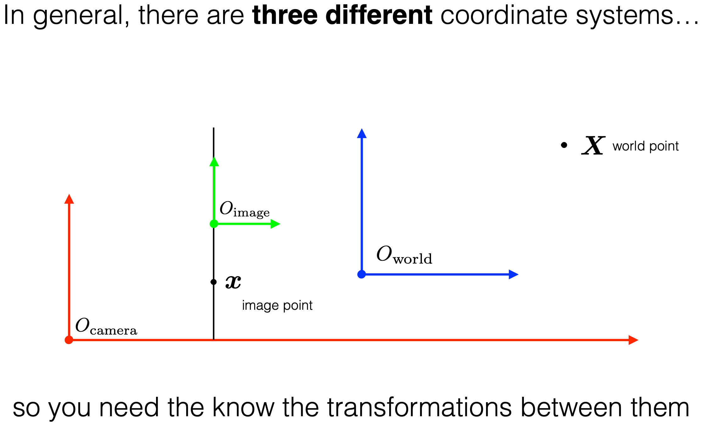
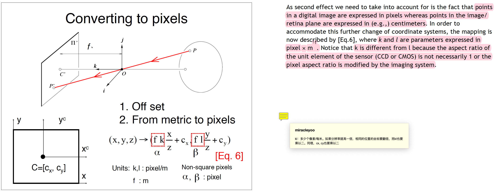
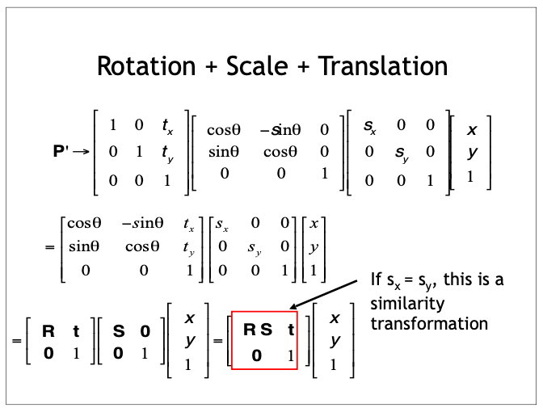
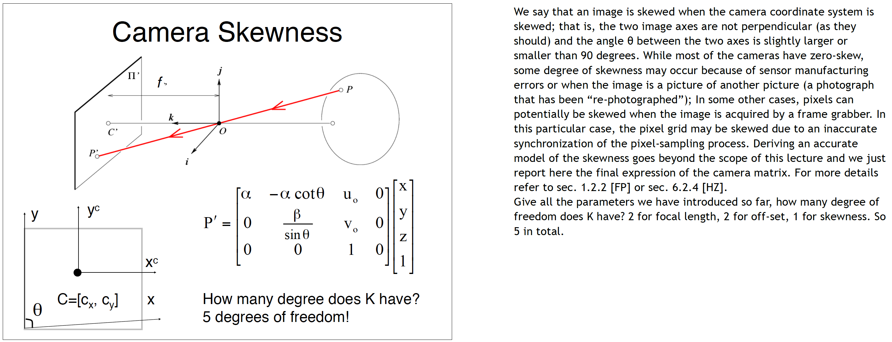
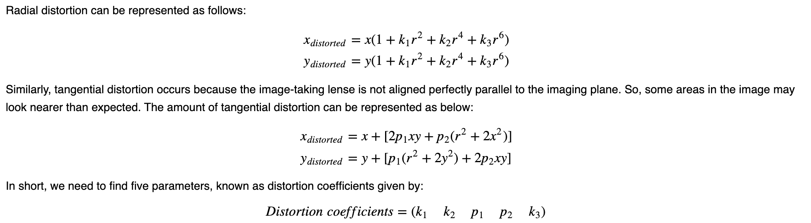
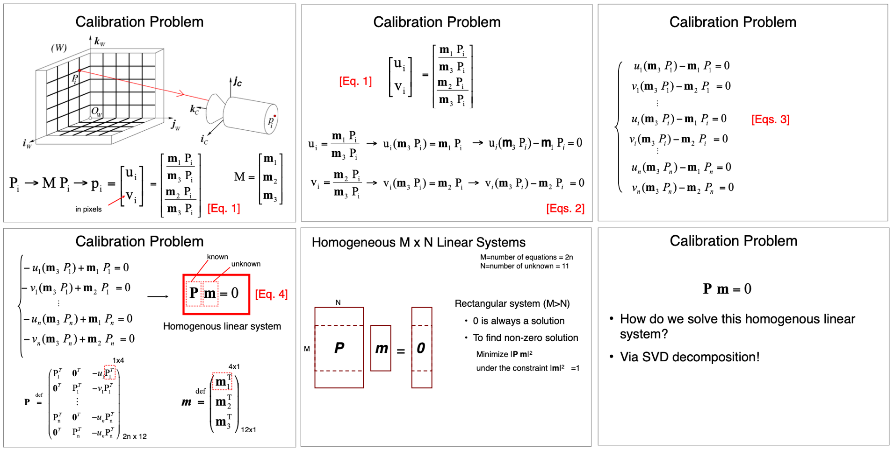
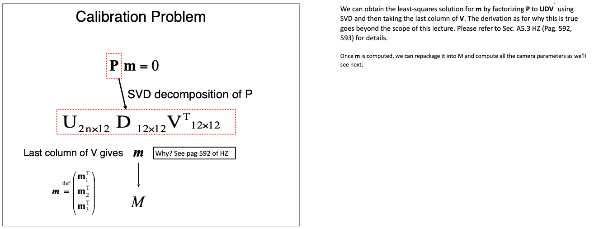
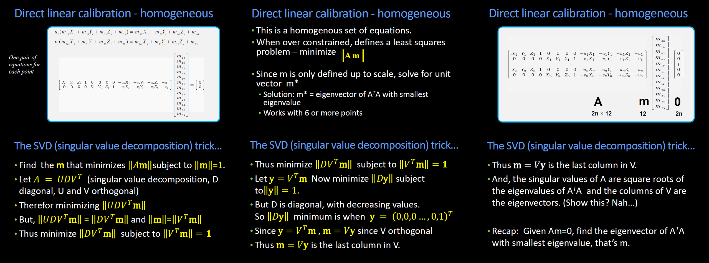

# 相机校准

首先是几张非常重要的Slides，后面都会refer到，可以先自行熟悉下。另外，本篇不是100%从零开始的教程，篇幅限制并无法展开所有的细节，若想深度理解，请自行结合几个大学（CMU，Stanford）相应的Slides一起学习。






## Coordinates

- 在整个相机的投影与校准过程中，一共涉及3个坐标系。它们分别是：
  1. 世界坐标系：以空间中某点为原点建立欧拉坐标系，设定xyz方向后形成的坐标系。
  2. 相机坐标系。该坐标系的原点是相机的焦点。焦点一般在相机内部，也可能落在的相机外部，这取决于focal length。坐标系的指向：x和y就是相平面的横纵坐标方向（相机视角方向），z是与xy平面垂直的方向，亦即镜头指向的前方。
  3. 图像坐标系（也可以分成两个：图像坐标系(m)和像素坐标系(pixel)）。值得注意的一点是每个像素并不是真正的一个点，pixel坐标系所代表的整数值是每个像素点的中心。 
- 考虑功能性，还有一个同质坐标系，用于实际运算。



## Intrinsic

- 理想状况下（无Skewness和Distortion），Intrinsic 矩阵Encode的信息有：Focal Length、Image Sensor的长宽（in pixel），每像素代表的米数(pixel/m)，也即相机的分辨率。

- 非理想情况下，Skewness和Distortion也会被放到Intrinsic中。

- 关于当提高/降低分辨率时候的Intrinsic变化：$k,l,c_x,c_y$都要乘以分辨率提高的系数。

  

- 参见Intrinsic的计算过程，由于计算时已经考虑了目标物体深度对成像位置的影响，所以Intrinsic其实是包含了透视(perspective)信息的。

- Intrinsic可使相机坐标系转化为图片坐标系。

## Extrinsic

- Extrinsic 可以看作是两个矩阵写在了一起：旋转矩阵R和平移矩阵T。前三列是R，最后一列是T。 其实，虽然经常写作$[R|T]$，但事实上还有一个相似变换S，这个S是个对角线矩阵，对角线上的值为$[S_x, S_y, S_z, 1]$。S直接和R乘在一起，与T无关。

  

- Extrinsic可使世界坐标系转化为相机坐标系。

## Skewness and Distortion

- Skewness指的是相机Sensor的两个轴不垂直，即xy之间有一个小夹角。通常这不会发生，但如果有制造方面的问题，这也是可能的。

- 相机的Skewness

- Skewness的解决方法是把这个夹角找到，并在Intrinsic中反映出来。

  

- Distortion包含：

  - *Radial Distortion* (径向畸变)： 
  - *Tangential distortion* (切向畸变)：本质上是相平面和相机坐标系存在一个夹角，即“图像Sensor和镜头截面不平行”。

- 关于Distortion的计算：

  

## Homogeneous Coordinates

- 同质坐标的主要用意是把本来在分母上的z（深度）给挪走，以便让投影这个Transformation从non-linear变成Linear。
- 注意同质坐标虽然在视觉效果上是在原本的坐标(u,v)或(x,y,z)下面加了一个1，但是实际上这个1在欧式坐标系中并不存在。当我们后面列出方程校准时，应该回到原本的欧式坐标系解。


## IMU

- IMU输出三个方向角速度和三个轴向加速度的值，使用时也需要校准。
- 具体校准方法参见Kalibr和DV，因为我没用上，所以不多展开。

## DVS

- DVS的校准主要分为两种方法：
  - 一种是直接用paired的RGB进行校准，毕竟这里的RGB和DVS share同一组透镜。
  - 如果没有这个RGB，就直接用accumulate的frame做校准。

## Methods

### 解方程直接校准P矩阵

- 在Paper *DHP19: Dynamic Vision Sensor 3D Human Pose Dataset*里， 他们采用的方法是：直接在经过Mocap校准的空间中放置一系列Markers，然后在DVS的RGB（APS）输出frame中直接进行手动标注，得到其在image plane中的$(u, v)$坐标， 然后解方程。

  

- 上图中提到了一个点：从投影矩阵计算相机坐标系的原点，即相机的焦点位置的方法：$C=Q^{-1}c_4$。具体的推理其实很简单，主要就靠一个条件公式：$PC=0$，即原点的投影是0。

- 细节上，他们用了38个Marker，并8次改变它们的位置，通过最小平方法解得最接近的11个P中参数值。这里的最小平方法的意义在于通过增加数据点取平均P值来减小误差。其实11组式子就够了，但这里还是用了$8\times38\times2$个公式，就在于此。

- 具体的最小平方法介绍及代码：[Link](https://pythonnumericalmethods.berkeley.edu/notebooks/chapter16.04-Least-Squares-Regression-in-Python.html)

- 这个全矩阵P其实包含了Camera Intrinsic *K*， Camera Extrinsic *RT*, 以及Camera Skewness。

- 理论：

  

  

- 代码：

  ```python
  # Least Square Calibration for Camera Projection Matrix using Numpy
  def svd_calibration(points_3d, points_2d):
      # points_3d: 3D points in world coordinate
      # points_2d: 2D points in image coordinate
      # return: projection matrix
      assert points_3d.shape[0] == points_2d.shape[0]
      assert points_3d.shape[1] == 3
      assert points_2d.shape[1] == 2
      num_points = points_3d.shape[0]
      A = np.zeros((2 * num_points, 12))
      for i in range(num_points):
          A[2 * i, 0:4] = *(points_3d[i, :]), 1
          A[2 * i, 8:12] = *(-points_2d[i, 0] * points_3d[i, :]), -points_2d[i, 0]
          A[2 * i + 1, 4:8] = *(points_3d[i, :]), 1
          A[2 * i + 1, 8:12] = *(-points_2d[i, 1] * points_3d[i, :]), -points_2d[i, 0]
      U, S, V = np.linalg.svd(A)
      P = V[-1, :].reshape((3, 4))
      return P
  
  # OR
    
  # Least Square Calibration for Camera Projection Matrix
  def least_square_calibrate_camera_projection_matrix_np(x,y,z,u,v):
      # x,y,z: 3D points in world coordinate
      # u,v: 2D points in image coordinate
      # return: projection matrix
      assert len(x) == len(y) == len(z) == len(u) == len(v)
      num_points = len(x)
      A = np.zeros((2 * num_points, 12))
      for i in range(num_points):
          A[2 * i, 0:4] = x[i], y[i], z[i], 1
          A[2 * i, 8:12] = -u[i] * x[i], -u[i] * y[i], -u[i] * z[i], -u[i]
          A[2 * i + 1, 4:8] = x[i], y[i], z[i], 1
          A[2 * i + 1, 8:12] = -v[i] * x[i], -v[i] * y[i], -v[i] * z[i], -v[i]
      U, S, V = np.linalg.svd(A)
      P = V[-1, :].reshape((3, 4))
      return P
  ```

- 注意：SVD这里是用于解决Least Squares Problem的，如果直接用`np.linalg.lstsq`函数的话（b取全0），会解得一个全0矩阵（因为0永远是一个解）。

- SVD的解法细节：

  

- 解SVD的时候可以选择把P矩阵右下角$P_{(3,4)}$设为1。不设是homogeneous解法，设了之后是inhomogeneous。

### kalibr

- [Link](https://github.com/ethz-asl/kalibr)

- Used for:

  1. **Multi-Camera Calibration**: Intrinsic and extrinsic calibration of a camera-systems with non-globally shared overlapping fields of view
  2. **Visual-Inertial Calibration (CAM-IMU)**: Spatial and temporal calibration of an IMU w.r.t a camera-system along with IMU intrinsic parameters
  3. **Multi-Inertial Calibration (IMU-IMU)**: Spatial and temporal calibration of an IMU w.r.t a base inertial sensor along with IMU intrinsic parameters (requires 1-aiding camera sensor).
  4. **Rolling Shutter Camera Calibration**: Full intrinsic calibration (projection, distortion and shutter parameters) of rolling shutter cameras.

- 简单说就是主攻多相机/IMU系统。[多个相机](https://github.com/ethz-asl/kalibr/wiki/multiple-camera-calibration)，[多个IMU](https://github.com/ethz-asl/kalibr/wiki/Multi-IMU-and-IMU-intrinsic-calibration)，[相机+IMU](https://github.com/ethz-asl/kalibr/wiki/camera-imu-calibration)等。

- 校准出来的Extrinsic结果并不是相对原点绝对的，而是多个设备间相对的。比如IMU+Cam校准出来的Extrinsic就是IMU相对于Cam坐标的变换。

  引用一段[原话](https://github.com/ethz-asl/kalibr/wiki/yaml-formats)：

  > - **T_cn_cnm1**
  >   camera extrinsic transformation, always with respect to the last camera in the chain
  >   (e.g. cam1: T_cn_cnm1 = T_c1_c0, takes cam0 to cam1 coordinates)
  > - **T_cam_imu**
  >   IMU extrinsics: transformation from IMU to camera coordinates (T_c_i)
  > - **timeshift_cam_imu**
  >   timeshift between camera and IMU timestamps in seconds (t_imu = t_cam + shift)

- 综上所述，Kalibr并不是满足我们需求的校准方案。

### DV Calibration

- [Tutorial Link](https://inivation.gitlab.io/dv/dv-docs/docs/tutorial-calibration/), [Code Link](https://gitlab.com/inivation/dv/dv-imu-cam-calibration)
- 单个多个DVS都可以。
- 基于Kalibr的方案。
- 对于单个DVS，校准主要进行的是undistortion，且可以在校准后直接应用于相机后续的图像，让后面的record都不再有失真。
- 这里的校准可以有效应对之前Upal教授提出的扭曲问题，应在后续操作中应用。

### OpenCV Camera Calibration

- 这个校准会使用chessboard，而关于3d坐标，他们用了棋盘上两个相邻的点的实际距离是已知的这个特性（因为打印的标准棋盘，间距是固定的，如30mm），来提供相应的3D坐标信息。

- 这个校准会分别输出Intrinsic matrix (mtx), rotation matrix (R, rvecs), translation matrix (T, tvecs), Distortion coefficients (dist)。这些输出可以直接被用来纠偏。

  ```python
  # generate camera matrixes
  ret, mtx, dist, rvecs, tvecs = cv.calibrateCamera(objpoints, imgpoints, gray.shape[::-1], None, None)
  
  img = cv.imread('left12.jpg')
  h,  w = img.shape[:2]
  newcameramtx, roi = cv.getOptimalNewCameraMatrix(mtx, dist, (w,h), 1, (w,h))
  
  # undistort
  dst = cv.undistort(img, mtx, dist, None, newcameramtx)
  # crop the image
  x, y, w, h = roi
  dst = dst[y:y+h, x:x+w]
  cv.imwrite('calibresult.png', dst)
  ```

- 关于OpenCV校准出来的Extrinsic Matrix，由于世界坐标系必定有一个原点，所以它们也是毫无疑问有一个原点的。但这个世界坐标系原点实际上只有参考意义（第一张校准图的左上角棋盘点），并无法直接使用。同时，相机坐标系的原点是相机的焦点，而这个焦点也是几乎不可预知和测量位置的（它可能在相机内部或外部，但校准并不会告诉你这个点位置，所以你也无法通过直接测量相机O点和实际世界O点之间的相对位置来纠正Extrinsic。）

  > [Link](https://www.appsloveworld.com/opencv/100/91/opencv-camera-calibration-world-coordinate-system-origin): I believe it used to be the position of the top-left corner of the checkerboard in the first calibration image, but it may have changed. You can visualized it by writing a few lines of code that project point (0,0,0) (in calibrated scene coordinates) in all the calibration images, then plotting its projected image coordinates on top of the image themselves.
  >
  > You should really not depend on it being anything meaningful, and instead locate a separate feature in 3D and roto-translate the reference frame to it after calibration.

- 实际上，不要想通过OpenCV的校准来直接得到有实际意义的Extrinsic，若想得到，请自行用前面提到的Method 1来实际label一些已知3D坐标的Markers对应的2D点，用Least Squares解得。

- 但是，OpenCV的校准可以提供有效的Distortion Coefficient和Intrinsic，并可直接被用于畸变补偿。

## Reference

### Blogs/Websites

- [Least Squares Regression in Python](****https://pythonnumericalmethods.berkeley.edu/notebooks/chapter16.04-Least-Squares-Regression-in-Python.html****)
- [Why does SVD provide the least squares and least norm solution to 𝐴𝑥=𝑏?](https://math.stackexchange.com/questions/974193/why-does-svd-provide-the-least-squares-and-least-norm-solution-to-a-x-b)
- [How does the SVD solve the least squares problem?](https://math.stackexchange.com/questions/772039/how-does-the-svd-solve-the-least-squares-problem)
- [What is the "real world coordinate system" camera calibration refer to in computer vision?](https://www.quora.com/What-is-the-real-world-coordinate-system-camera-calibration-refer-to-in-computer-vision)
- [numpy linalg svd](https://numpy.org/doc/stable/reference/generated/numpy.linalg.svd.html)
- [OpenCV Camera Calibration](https://docs.opencv.org/4.x/dc/dbb/tutorial_py_calibration.html)

### Slides

- [Udacity CS4495/6495 Introduction to Computer Vision 3C-L3 Calibrating cameras](https://s3.amazonaws.com/content.udacity-data.com/courses/ud810/slides/Unit-3/3C-L3.pdf#fromHistory)
- [CMU - Camera Matrix](https://www.cs.cmu.edu/~16385/s17/Slides/11.1_Camera_matrix.pdf)
- [Stanford - Lecture 2](https://cvgl.stanford.edu/teaching/cs231a_winter1314/lectures/lecture2_camera_models.pdf)
- [Stanford - Lecture 3](https://cvgl.stanford.edu/teaching/cs231a_winter1314/lectures/lecture3_camera_calibration.pdf)

### Papers

- [A Flexible New Technique for Camera Calibration](https://www.microsoft.com/en-us/research/wp-content/uploads/2016/02/tr98-71.pdf)

